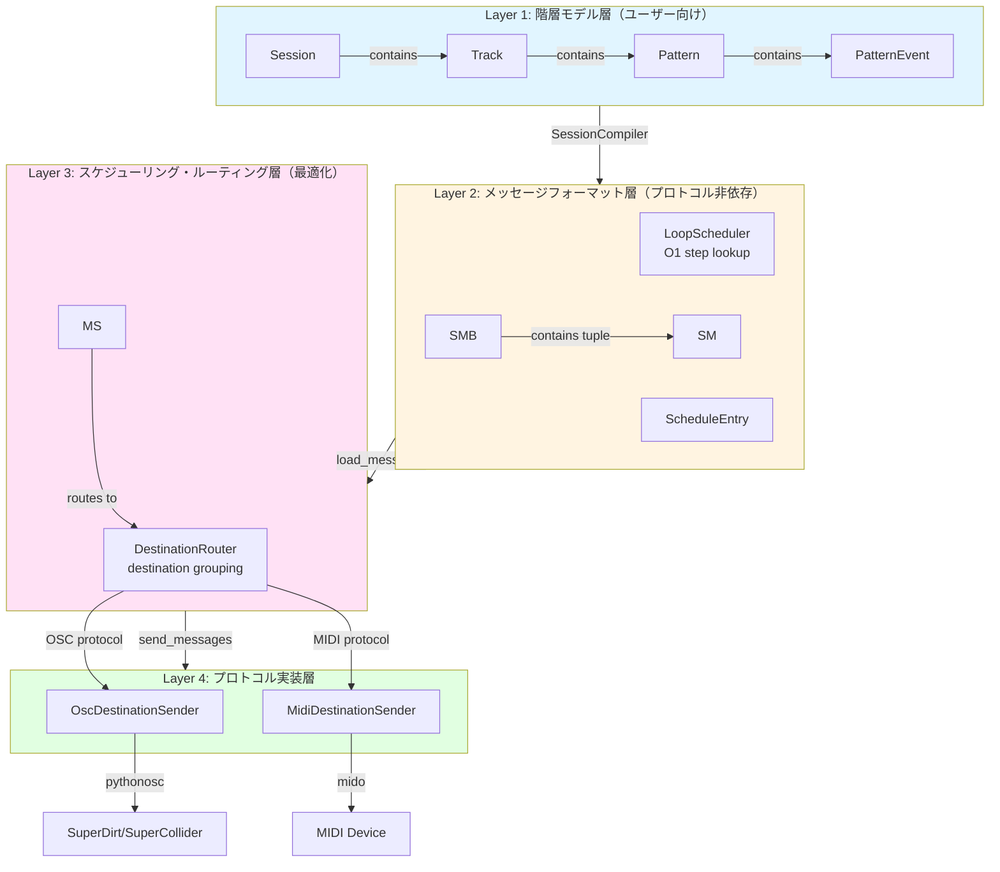
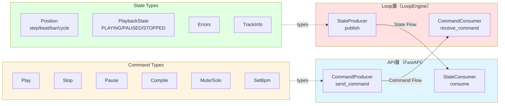
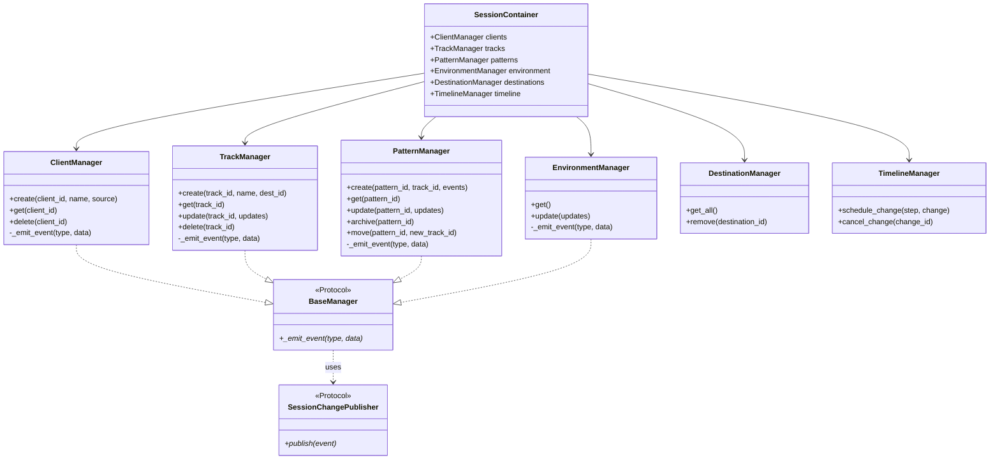
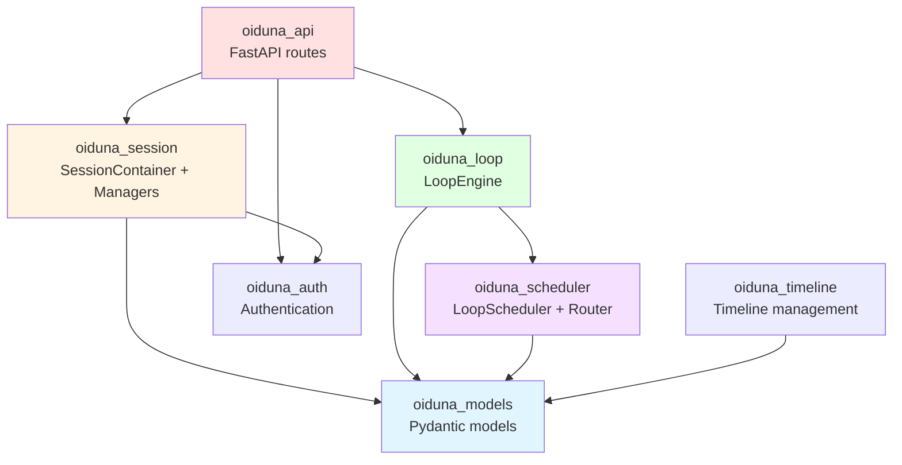
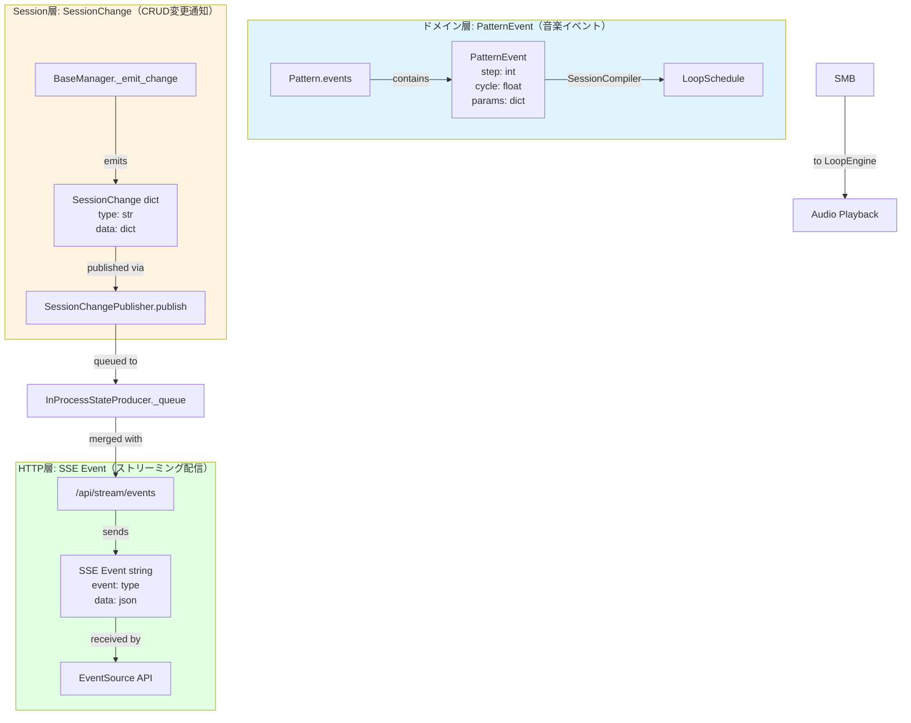
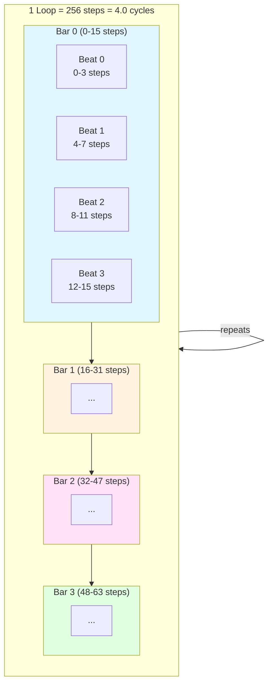

# Oiduna アーキテクチャ図

**バージョン**: 1.0.0
**作成日**: 2026-03-11
**対象**: Oiduna開発者

このドキュメントは、Oidunaシステムのアーキテクチャを視覚化したMermaid図を提供します。

## 目次

1. [Layer 1-4 処理フロー](#layer-1-4-処理フロー)
2. [Producer/Consumer IPC関係](#producerconsumer-ipc関係)
3. [SessionContainer + Managers構成](#sessioncontainer--managers構成)
4. [パッケージ間依存関係](#パッケージ間依存関係)
5. [Event用語の3つの文脈](#event用語の3つの文脈)

---

## Layer 1-4 処理フロー

Oidunaは4層のデータ変換アーキテクチャで構成されています。



**責務の分離**:
- **Layer 1**: データバリデーションのみ（Pydantic）
- **Layer 2**: Destination-Agnosticな表現（frozen dataclass）
- **Layer 3**: パフォーマンス最適化（O(1)検索、ルーティング）
- **Layer 4**: プロトコル固有の送信処理

**コード参照**:
- Layer 1: `packages/oiduna_models/`
- Layer 2: `packages/oiduna_scheduler/scheduler_models.py`
- Layer 3: `packages/oiduna_scheduler/scheduler.py`, `router.py`
- Layer 4: `packages/oiduna_scheduler/senders.py`

---

## Producer/Consumer IPC関係

API層とLoop層の間で双方向のIPC通信を行います。



**実装の種類**:
- **InProcessStateProducer**: キューベース（単一プロセス）
- **ZeroMQ**: プロセス間通信（マルチプロセス）

**プロトコル定義**: `packages/oiduna_loop/ipc/protocols.py`

---

## SessionContainer + Managers構成

SessionContainerは6つの専門Managerを集約します。



**設計パターン**:
- **Container Pattern**: SessionContainerは軽量コンテナ（Facadeパターン廃止）
- **Single Responsibility**: 各Managerは単一ドメインのCRUD操作のみ
- **Protocol-Based**: BaseManagerとSessionChangePublisherでインターフェース定義

**コード参照**:
- `packages/oiduna_session/container.py` - SessionContainer
- `packages/oiduna_session/managers/base.py` - BaseManager protocol
- `packages/oiduna_session/managers/*_manager.py` - 各Manager実装

---

## パッケージ間依存関係

単方向依存を維持し、循環依存を避けます。



**依存ルール**:
- **oiduna_models**: 最下層、他に依存しない
- **oiduna_scheduler**: modelsのみに依存
- **oiduna_session**: models、authに依存
- **oiduna_loop**: scheduler、modelsに依存
- **oiduna_api**: 上位層、すべてに依存可能

**循環依存の禁止**:
```python
# ✅ OK: Higher layer → Lower layer
from oiduna_models import Track
from oiduna_scheduler import LoopScheduler

# ❌ NG: Lower layer → Higher layer
# oiduna_models内で oiduna_api をimportしてはいけない
```

**コード参照**: 各パッケージの`__init__.py`と`pyproject.toml`

---

## Event用語の3つの文脈

Oidunaでは「Event」という用語が**3つの異なる文脈**で使用されます。



**比較表**:

| 項目 | PatternEvent | SessionChange | SSE Event |
|------|-------------|---------------|-----------|
| **レイヤー** | ドメインモデル | Session層 | HTTP層 |
| **データ型** | PatternEvent class | dict | string |
| **目的** | 音楽的タイミング | CRUD変更通知 | HTTP配信 |
| **頻度** | 多数（パターン内） | 低頻度（操作時） | 高頻度（統合） |
| **送信先** | SessionCompiler | SSE endpoint | ブラウザ |

**データフロー**:
1. **PatternEvent**: Pattern → LoopSchedule → LoopEngine → 音楽再生
2. **SessionChange**: Manager → SessionChangePublisher → InProcessStateProducer queue
3. **SSE Event**: InProcessStateProducer queue → /api/stream/events → ブラウザ

**コード参照**:
- PatternEvent: `packages/oiduna_models/events.py`
- SessionChange: `packages/oiduna_session/managers/base.py`
- SSE Event: `packages/oiduna_api/routes/stream.py`

---

## 追加の図

### Timing Model（タイミングモデル）



**時間単位の関係式**:
```
1 step    = 1/16 note
4 steps   = 1 beat (1/4 note)
16 steps  = 1 bar (4 beats)
256 steps = 16 beats = 4 bars = 1 loop = 4.0 cycles
```

**BPMと時間**（120 BPM）:
- 1 step = 125ms
- 1 beat = 500ms
- 1 bar = 2秒
- 1 loop = 32秒

**コード参照**: `packages/oiduna_loop/engine/loop_engine.py:23` (LOOP_STEPS = 256)

---

## まとめ

これらの図は、Oidunaシステムのアーキテクチャを視覚的に理解するためのリファレンスです。

**重要な設計原則**:
1. **Layer分離**: Layer 1-4で責務を明確に分離
2. **双方向IPC**: Producer/Consumerパターンで疎結合
3. **Manager分離**: SessionContainerで単一責任原則を実現
4. **単方向依存**: パッケージ間の循環依存を排除
5. **Event用語の区別**: 3つの異なる文脈を明確化

**参考ドキュメント**:
- [ARCHITECTURE.md](../ARCHITECTURE.md) - システム全体のアーキテクチャ
- [TERMINOLOGY.md](../TERMINOLOGY.md) - 用語集
- [OIDUNA_CONCEPTS.md](../OIDUNA_CONCEPTS.md) - 設計哲学
- [CODING_CONVENTIONS.md](../CODING_CONVENTIONS.md) - コーディング規約

---

**バージョン**: 1.0.0
**作成日**: 2026-03-11
**メンテナンス**: アーキテクチャ変更時は図を更新
