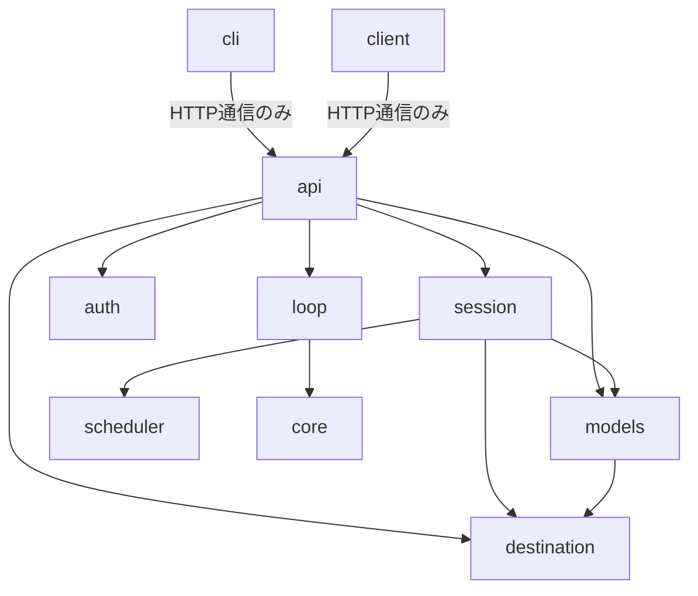

# Oiduna アーキテクチャクイックリファレンス

**作成日**: 2026-03-01

このドキュメントは、各層の要点を素早く参照するためのリファレンスです。

## 全体構造

```
External Interface (Optional): (cli, client)       → HTTP通信のみ
Layer 1: API                  (api)               → 薄いHTTPラッパー
Layer 2: Application          (session, auth)     → ビジネスロジック、Manager分離
Layer 3: Core                 (loop, core)        → リアルタイム実行
Layer 4: Domain               (scheduler)         → O(1)メッセージ検索
Layer 5: Data                 (models, destination)→ Pydanticモデル
```

## 依存関係（上から下への一方向）



## データフロー（簡易版）

```
1. HTTP POST /clients/alice
   → api → session.clients.create()
   → ClientInfo生成 → session.clients["alice"]

2. HTTP POST /tracks/kick
   → api → session.tracks.create()
   → destination存在確認 → Track生成 → session.tracks["kick"]

3. SessionCompiler.compile(session)
   → ScheduledMessageBatch生成

4. MessageScheduler(batch)
   → ステップ別インデックス構築

5. LoopEngine
   → ClockGenerator (256ステップ)
   → scheduler.get_at_step(step)
   → DestinationRouter
      ├→ OSCSender → SuperDirt
      └→ MIDISender → MIDI機器
```

## Rust移植優先度

1. 🔥 最優先: models, destination, core（データ構造）
2. 🔥 最優先: loop（パフォーマンスクリティカル）
3. 🔶 中優先: scheduler, session（最適化）
4. 🔷 低優先: api, auth, cli, client（Python成熟）

## 各層の核心

### Layer 5: Data
- **核心**: Pydanticバリデーション
- **ファイル**: `session.py`, `track.py`, `pattern.py`, `event.py`

### Layer 4: Domain
- **核心**: O(1)ステップ検索インデックス
- **ファイル**: `scheduler.py`, `scheduler_models.py`

### Layer 3: Core
- **核心**: 256ステップクロック、ドリフト補正
- **ファイル**: `engine.py`, `clock.py`, `router.py`

### Layer 2: Application
- **核心**: Manager分離、Silent Failure防止
- **ファイル**: `container.py`, `managers/*.py`, `compiler.py`

### Layer 1: API
- **核心**: 薄いHTTPラッパー
- **ファイル**: `routes/*.py`, `dependencies.py`

### External Interface
- **核心**: HTTP APIクライアント
- **ファイル**: CLIツール、Pythonライブラリ

## 重要なファイルパス

```
packages/oiduna_models/session.py          # Session定義
packages/oiduna_scheduler/scheduler.py     # MessageScheduler
packages/oiduna_loop/engine.py             # LoopEngine
packages/oiduna_session/container.py       # SessionContainer
packages/oiduna_api/main.py                # FastAPI app
```

## テストパス

```
packages/oiduna_models/tests/              # モデルテスト
packages/oiduna_session/tests/             # セッション管理テスト
tests/integration/                         # 結合テスト
tests/test_api_integration.py              # APIテスト
```

---

詳細は各層のドキュメントを参照：
- [README](./README.md) - 全体インデックス
- [External Interface](./external-interface.md) - クライアント層
- [Layer 1](./layer-1-api.md) - API層
- [Layer 2](./layer-2-application.md) - アプリケーション層
- [Layer 3](./layer-3-core.md) - コア層
- [Layer 4](./layer-4-domain.md) - ドメイン層
- [Layer 5](./layer-5-data.md) - データ層
